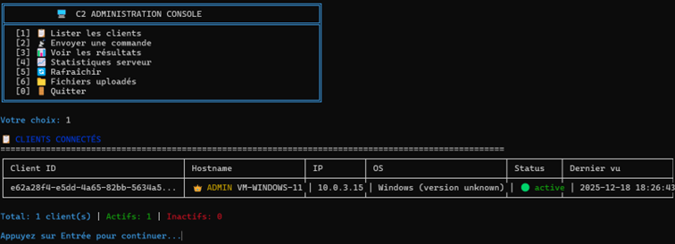
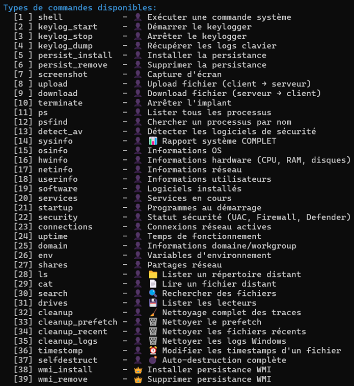
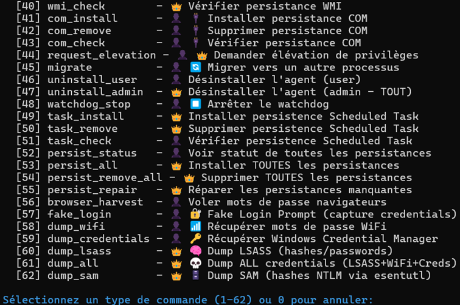
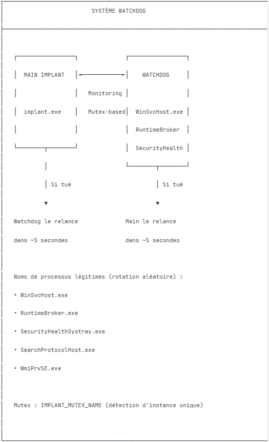
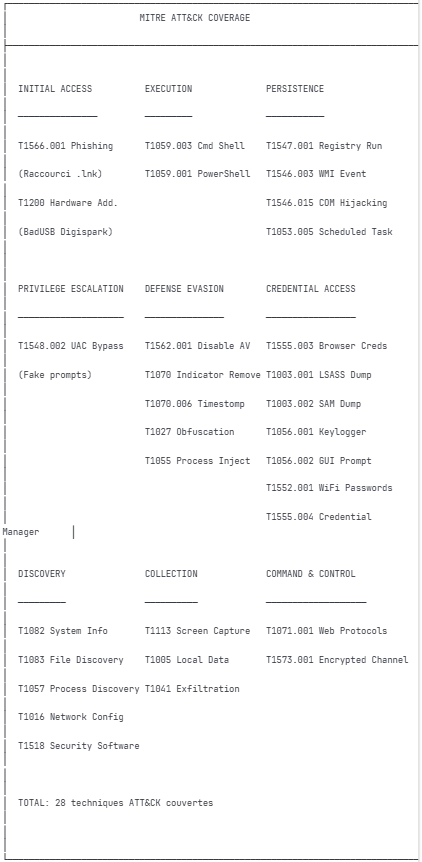

# 🎯 Educational RAT Project - Remote Administration Tool


**A fully-featured Remote Administration Tool developed for educational purposes in cybersecurity engineering.**

---

## ⚠️ Important Disclaimer

**This project was developed strictly for educational purposes** as part of a cybersecurity engineering curriculum. The goal was to understand offensive security techniques, malware architecture, and detection evasion mechanisms through hands-on development.

**See [DISCLAIMER.md](DISCLAIMER.md) for full legal information.**

> 🚫 **The C++ implant source code is NOT published** to prevent malicious use. Only the C2 server (Python) and documentation are available.

---

## 🏗️ Architecture


This project demonstrates the development of a complete Command & Control (C2) infrastructure, including:

| Component | Language | Description |
|-----------|----------|-------------|
| **Implant** | C++ | Windows agent with 62 commands, AV evasion, persistence |
| **C2 Server** | Python/Flask | REST API for implant management |
| **CLI** | Python | Operator console interface |
| **BadUSB** | Arduino | Digispark-based initial access vector |

### 🏆 Key Achievements

- ✅ **Windows Defender Bypass** - Undetected at time of development
- ✅ **62 Operational Commands** - Reconnaissance, credential harvesting, persistence, cleanup
- ✅ **ECDH Key Exchange** - Perfect Forward Secrecy with P-256 curve
- ✅ **AES-256-CBC Encryption** - All C2 communications encrypted
- ✅ **Multiple Persistence Mechanisms** - Registry, COM Hijacking, Scheduled Tasks, WMI
- ✅ **Dual-Process Architecture** - Implant + Watchdog for resilience

---

## 🖥️ C2 Console Interface



The operator console provides a user-friendly interface to manage connected implants, send commands, and retrieve results in real-time.

---

## 📊 Command Categories

The implant supports **62 commands** organized into categories:





| Category | Commands | Description |
|----------|----------|-------------|
| **System** | `shell`, `ps`, `sysinfo`, `osinfo`, `hwinfo` | System interaction |
| **Keylogger** | `keylog_start`, `keylog_stop`, `keylog_dump` | Keystroke capture |
| **Files** | `ls`, `cat`, `search`, `upload`, `download` | File operations |
| **Credentials** | `browser_harvest`, `dump_wifi`, `dump_lsass` | Credential theft |
| **Persistence** | `persist_install`, `com_install`, `wmi_install` | Survival mechanisms |
| **Evasion** | `migrate`, `cleanup`, `timestomp`, `selfdestruct` | Anti-forensics |

---

## 🧩 Implant Modular Architecture


The C++ implant is built with a modular architecture, separating concerns into:
- **Core Modules** - C2 communication, cryptography, shell execution
- **Evasion Modules** - Anti-debug, sleep obfuscation, API unhooking
- **Collection Modules** - Keylogger, screenshot, file transfer
- **Persistence Modules** - Registry, WMI, COM hijacking, scheduled tasks

---

## 🔄 Watchdog System



The dual-process architecture ensures resilience:
- **Main Implant** and **Watchdog** monitor each other via mutex
- If one is killed, the other relaunches it within ~5 seconds
- Process names rotate through legitimate Windows process names

---

## 🔐 Cryptographic Protocol

### Key Exchange (ECDH)

```
┌───────────────────────────────────────────────────────────────┐
│                    ECDH KEY EXCHANGE                          │
├───────────────────────────────────────────────────────────────┤
│                                                               │
│  IMPLANT                              C2 SERVER               │
│                                                               │
│  1. Generate ECDH keypair             1. Generate ECDH keypair│
│     (P-256 curve)                        (P-256 curve)        │
│                                                               │
│  2. ──── Send public key (72 bytes) ────────────────────►     │
│                                                               │
│  3. ◄─── Receive server public key ─────────────────────      │
│                                                               │
│  4. Compute shared secret             4. Compute shared secret│
│     S = privA × pubB                     S = privB × pubA     │
│                                                               │
│  5. Derive AES key                    5. Derive AES key       │
│     AES_KEY = SHA256(S)                  AES_KEY = SHA256(S)  │
│                                                               │
│  ══► Both have identical AES-256 key without transmitting it │
│                                                               │
└───────────────────────────────────────────────────────────────┘
```

### Why ECDH instead of RSA?

| Feature | RSA Key Transport | ECDH |
|---------|-------------------|------|
| **Perfect Forward Secrecy** | ❌ No | ✅ Yes |
| **Key Size** | 2048+ bits | 256 bits |
| **Performance** | Slower | Faster |
| **If server key leaked** | All past traffic decryptable | Past traffic protected |

---

## 🎯 MITRE ATT&CK Mapping



This project implements **28 techniques** across the MITRE ATT&CK framework:

| Tactic | Technique | Implementation |
|--------|-----------|----------------|
| **Initial Access** | T1091 - Replication Through Removable Media | BadUSB (Digispark) |
| **Execution** | T1059.001 - PowerShell | Hidden download & execute |
| **Persistence** | T1547.001 - Registry Run Keys | `HKCU\...\Run` |
| **Persistence** | T1546.015 - COM Hijacking | MMDeviceEnumerator |
| **Persistence** | T1053.005 - Scheduled Task | Task Scheduler |
| **Persistence** | T1546.003 - WMI Event Subscription | Event consumer |
| **Defense Evasion** | T1562.001 - Disable Security Tools | NTDLL unhooking |
| **Defense Evasion** | T1027 - Obfuscated Files | String encryption |
| **Credential Access** | T1555.003 - Credentials from Web Browsers | Chrome/Edge stealer |
| **Credential Access** | T1056.001 - Keylogging | Low-level keyboard hook |
| **C2** | T1573.001 - Encrypted Channel | AES-256-CBC |
| **C2** | T1071.001 - Web Protocols | HTTPS beaconing |

**Full mapping available in [docs/MITRE_ATTACK.md](docs/MITRE_ATTACK.md)**

---

## 📦 Repository Structure

```
📁 Educational-RAT-Project/
├── 📄 README.md              # This file
├── 📄 DISCLAIMER.md          # Legal disclaimer
├── 📄 LICENSE                # MIT License with Educational Clause
│
├── 📁 c2-server/             # Python C2 infrastructure
│   ├── 📄 server.py          # Flask REST API
│   ├── 📄 cli.py             # Operator console
│   ├── 📄 crypto_utils.py    # AES-256-CBC encryption
│   ├── 📄 dh_exchange.py     # ECDH P-256 key exchange
│   ├── 📄 client_manager.py  # Session management
│   ├── 📄 command_queue.py   # Task queue
│   ├── 📄 dashboard_stream.py# Live screenshot streaming
│   ├── 📄 logger.py          # Logging utilities
│   └── 📄 requirements.txt   # Python dependencies
│
├── 📁 docs/                  # Documentation
│   └── 📄 MITRE_ATTACK.md    # Full ATT&CK mapping
│
└── 📁 screenshots/           # Project screenshots
```

### NOT Published (intentionally)

- ❌ C++ implant source code
- ❌ Compiled binaries
- ❌ BadUSB payload
- ❌ Evasion technique implementations

---

## 🚀 C2 Server Setup

### Prerequisites

- Python 3.10+
- Ngrok account (for tunneling)

### Installation

```bash
# Clone the repository
git clone https://github.com/cycy958/Educational-RAT-Project.git
cd Educational-RAT-Project/c2-server

# Install dependencies
pip install -r requirements.txt

# Copy and configure
cp config.example.json config.json

# Start the server
python server.py
```

---

## 👤 Author

**Cyril** - Cybersecurity Engineering Student

- 🎓 3rd year cybersecurity engineering
- 🔐 Focus: Offensive security, malware development, red teaming

---

## 📄 License

This project is licensed under the MIT License with Educational Use Clause - see [LICENSE](LICENSE) file.

---

*"Know your enemy and know yourself, and you will never be defeated."* - Sun Tzu
